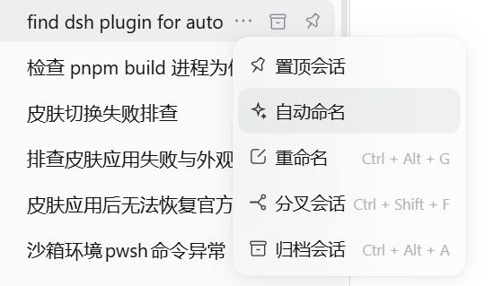
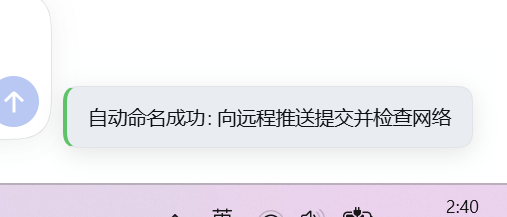

# DSH 自动命名

为 DeepSeek Harness 左侧会话的「…」菜单添加「自动命名」，方便在自动生成标题失败、只留下首条消息截取标题时，手动重试模型命名。它只针对点击的会话，不会发送新的聊天消息，也不会更改首次自动命名的策略。

## 效果

「自动命名」位于「置顶会话」与「重命名」之间，不占用快捷键。



点击后菜单照常收起，等待期间不显示“正在自动命名”，也不会出现阻断操作的弹窗。**只有请求结束后**，页面右下角才显示结果提示：成功时附带新标题，失败时附带错误原因。成功提示约 4 秒后消失，失败提示约 6 秒后消失；失败后可重新打开菜单重试。



> 截图展示的是成功提示；失败时会显示红色标记和失败原因。

## 安装

1. 克隆本仓库，或从 GitHub 下载并解压源码。
2. 在 DSH 的插件管理界面安装**包含 `package.json` 的目录**（即本仓库根目录），并启用插件。
3. 打开左侧任一会话的「…」菜单，点击「自动命名」。

```sh
git clone https://github.com/OldLigant/dsh-auto-rename.git
```

首次安装通常可以立即生效；**更新已安装的插件后，可能需要重启 DSH 并刷新网页**，才能加载新的 Host 和浏览器代码。仅刷新网页不一定会重载 Host 插件。

## 使用说明与限制

- 需要 DSH 已配置可用的**模型标题提供者**。没有提供者、模型生成失败，或者没有产生新标题时，插件会报告失败，不会把旧标题或首条消息的截取标题误报为成功。
- 明确点击「自动命名」会调用 DSH 的 `sessionTitle.refresh`；**已有的手工标题在成功生成新标题时也会被覆盖**。请不要将此操作用于需要保留手工标题的会话。
- DSH 原生标题服务可能在刷新过程中追加 fallback 标题事件；若此前是手工标题，插件会尽力在 fallback 返回时恢复它。因此不保证失败过程完全不写入会话日志，也不承诺能抵御同时发生的手工改名或取消操作。
- 请求期间不会显示加载状态；同一会话的重复点击不会发起并行请求。提示不是系统通知，关闭或刷新网页后不保留。
- 插件不会修改标题模型、提示词或 DSH 的自动命名时机。

## 兼容性

`peerDependencies` 仅声明已核查过接口的 DSH 精确版本：`0.1.7-rc.2`、`0.2.0-rc.1`、`0.2.0-rc.2`。这代表接口层面的兼容性检查，**不代表已在每个版本完成端到端实测**；其他版本需要重新验证后再加入支持范围。

插件由 Host 端的受认证请求接口 `/api/local.auto-rename.refresh` 和浏览器端的会话菜单项、页面浮层提示组成，不需要额外运行时依赖。
